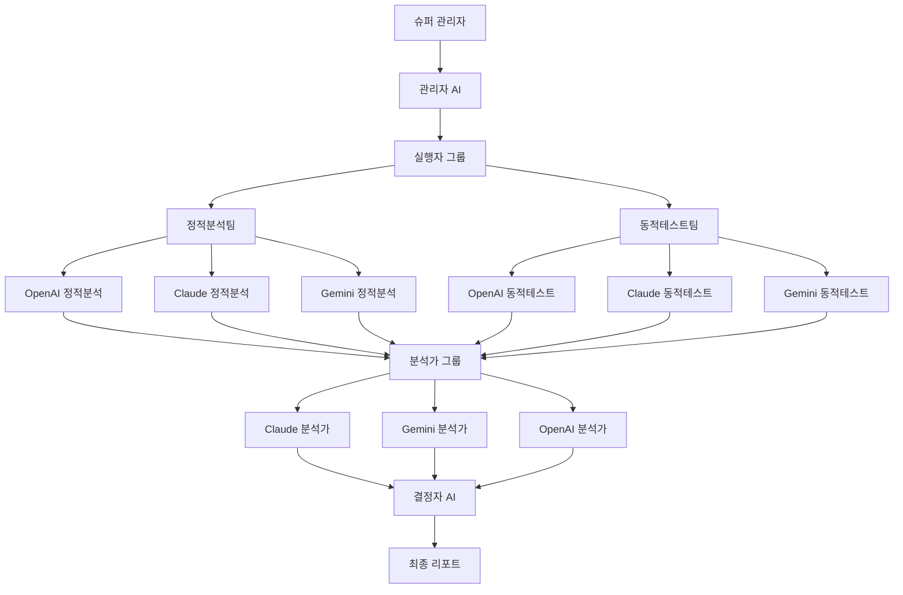

# 시스템 아키텍처

## 전체 구조



## 에이전트별 역할

### 1. 관리자 AI (OpenAI GPT-4)
- **역할**: 전체 프로세스 관리 및 조율
- **기능**:
  - 테스트 계획 수립
  - 작업 분배 및 우선순위 결정
  - 워크플로우 상태 모니터링
  - 에이전트 간 조율

### 2. 실행자 AI 그룹
#### 정적분석팀 (3개 AI)
- **OpenAI**: 코드 구조 분석, 보안 패턴 검사
- **Claude**: 안전성 중심 코드 리뷰, 취약점 탐지
- **Gemini**: 대용량 코드베이스 분석, 의존성 검사

#### 동적테스트팀 (3개 AI)
- **OpenAI**: 침투 테스트 시나리오 생성
- **Claude**: 안전한 테스트 케이스 설계
- **Gemini**: 성능 및 부하 테스트

### 3. 분석가 AI 그룹 (3개 AI)
- **Claude 분석가**: 보안 중심 종합 분석
- **Gemini 분석가**: 패턴 및 트렌드 분석
- **OpenAI 분석가**: 위험도 평가 및 우선순위

### 4. 결정자 AI (OpenAI GPT-4)
- **역할**: 최종 판단 및 리포트 생성
- **기능**:
  - 3개 분석 리포트 종합
  - 최종 보안 점수 산정
  - 실행 가능한 권장사항 제시

## 품질 제어 메커니즘

### 재실행 로직
```python
if analysis_quality < threshold:
    if retry_count < max_retries:
        retry_execution_phase()
    else:
        escalate_to_human()
```

### 품질 검증 기준
1. **완성도**: 모든 필수 항목 분석 완료
2. **일관성**: 여러 AI 결과 간 일치도
3. **신뢰도**: 분석 결과의 확신도 수준
4. **실행가능성**: 권장사항의 구체성

## 데이터 플로우

1. **입력**: 프로젝트 정보 + 테스트 범위
2. **계획**: 관리자 AI가 테스트 계획 수립
3. **실행**: 6개 실행자 AI가 병렬 테스트 수행
4. **분석**: 3개 분석가 AI가 독립적 분석
5. **결정**: 결정자 AI가 최종 판단
6. **출력**: 종합 보안 리포트

## 확장성 고려사항

### 수평 확장
- 실행자 AI 추가 (새로운 AI 모델)
- 분석가 AI 전문화 (도메인별)
- 테스트 유형 확장

### 수직 확장
- 더 강력한 AI 모델 적용
- 더 복잡한 분석 로직
- 실시간 피드백 시스템